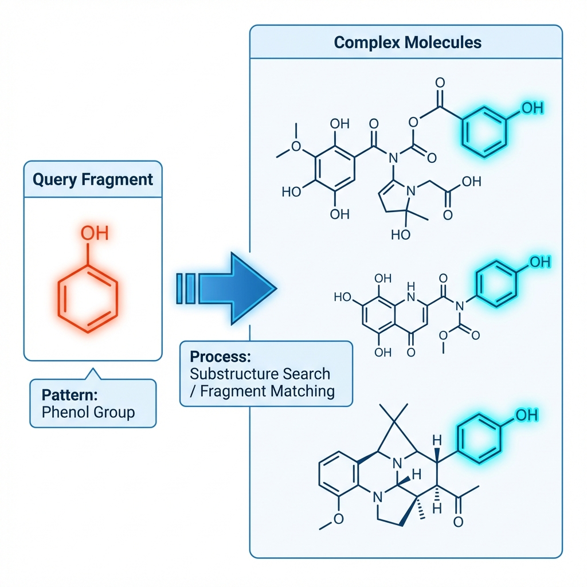
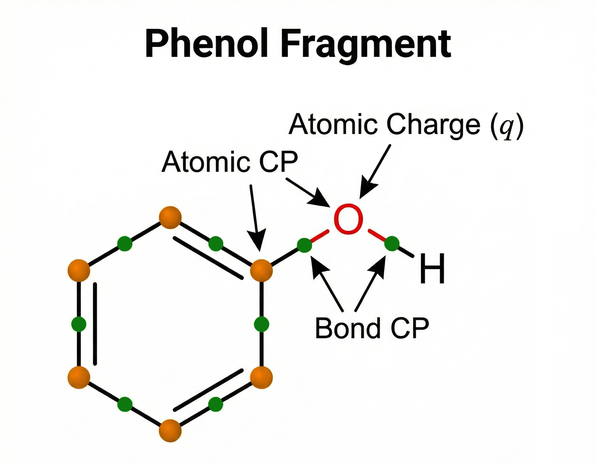

# DFT-ChemDescriptors


A comprehensive Python tool for obtaining **global and local molecular properties** using Density Functional Theory (DFT) results and generating standard chemical descriptors (RDKit, Mordred).

It supports **Gaussian (`.fchk`)** and **ORCA (`.wfn`/`.wfx`)** formats. This workflow automates the interaction with **Multiwfn** to compute quantum-chemical reactivity indices (Conceptual DFT), atomic charges, and topological properties (QTAIM), merging them with 1D/2D/3D molecular descriptors for QSAR/QSPR studies or machine learning. It is flexible regarding input states: while all three states (Neutral, Anion, Cation) are needed for Global Reactivity Indices, you can run it with **one or two states** to obtain local properties, fragment descriptors, and standard molecular descriptors.

## Key Features

*   **Global Reactivity Indices**: Automatically extracts Energies (N, N+1, N-1), IP, EA, Chemical Potential, Hardness, Softness, Electrophilicity, and Nucleophilicity.
*   **Local Property Analysis**:
    *   **Atomic Charges**: Computes charges using various population analyses (17 methods available, e.g., Hirshfeld, Voronoi, Mulliken, ADCH, CM5, AIM).
    *   **CDFT Descriptors**: Fukui indices ($f^+$, $f^-$, $f^0$), Conceptual Dual Descriptor (CDD), and local electrophilicity/nucleophilicity (Hirshfeld).
    *   **QTAIM Critical Points**: Calculates **Atomic Critical Points (ACPs)** and **Bond Critical Points (BCPs)** associated with the fragment.
    *   **Derived Fragment Properties**: Aggregated properties capturing the electronic environment and variability of the entire fragment.
*   **Descriptor Generation**: Calculates **1D, 2D, and 3D** descriptors using **RDKit** and **Mordred**.
*   **Interactive Fragment Finder**: A 3D graphical interface to identify common substructures across a series of molecules for targeted local property extraction.
    *   *Powered by [FragmentFinder](https://github.com/1JELC1/FragmentFinder).*

## Workflow & Methodology

The script follows a structured pipeline:

1.  **Input Processing**: Reads Gaussian/ORCA output files (`.fchk`, `.wfn`, or `.wfx`) for Neutral (N), Anion (N+1), and Cation (N-1) states.
2.  **Geometry Conversion**: Systematically obtains `.xyz` and `.mol` geometry files for descriptor libraries.
3.  **Global CDFT**: Processes the Neutral, Anion, and Cation files to generate CDFT output, extracting all **global reactivity indices**.
4.  **Local Property Extraction**:
    *   **Interactive Selection**: An interactive 3D interface opens to allow the user to select the common fragment across all molecules and specific atoms of interest.
    *   User selects which charge calculation methods to compute (from a list of 17).
    *   The script then executes the calculations.
    *   Finally, it extracts the properties (Charges, Fukui indices, CDD, ACPs, BCPs) specifically for the atoms in the selected fragment.
5.  **Descriptor Integration**: Combines quantum-mechanical properties with RDKit/Mordred descriptors into a single dataset.

## Calculated Properties

### Global Properties (`global_properties.csv`)
*   Energies: $E(N)$, $E(N+1)$, $E(N-1)$
*   Thermodynamic: Sum of electronic and Zero-Point/Thermal Enthalpies/Free Energies (if `.log` files provided).
*   Dipole Moment (requires `.log` files)
*   Chemical Potential ($\mu$)
*   Chemical Hardness ($\eta$) & Softness ($S$)
*   Electrophilicity Index ($\omega$)
*   Nucleophilicity Index ($N$)

### Local Properties (`local_properties.csv`)
**Common molecular fragment matching**: Before calculation, the script identifies the selected fragment in **all** target molecules using graph isomorphism:



Calculated for **selected atoms**, **bond critical points (BCPs)**, and **atomic critical points (ACPs)** that belong to the fragment:
*   **Charges and Derivatives**: Atomic charges (Hirshfeld, CM5, etc.), Fukui Indices, Conceptual Dual Descriptor (CDD).
*   **Topological (QTAIM)**:
    *   Electron Density ($\rho$)
    *   Laplacian of Electron Density ($\nabla^2\rho$)
    *   Lagrangian ($G$) and Hamiltonian ($K$) Kinetic Energy Densities
    *   Potential Energy Density ($V$)
    *   Energy Density ($H$)
    *   Electron Localization Function (ELF) & Local Orbital Locator (LOL)
    *   Average Local Ionization Energy (ALIE)
    *   Electrostatic Potential (ESP)



### Derived Local Descriptors (`derived_local_descriptors.csv`)
Descriptors calculated specifically for the **fragment atoms** to capture the immediate environment and property variability:

*   **Detailed Documentation**: Please refer to [Derived Fragment Properties](DERIVED_PROPERTIES.md) for a complete explanation of the aggregated charges, topological indices, and G/V ratios.
*   **Aggregated Properties**: Includes sums of atomic charges, sums of Fukui indices, and total electron density at Bond Critical Points (BCPs) within the fragment.

### Molecular Descriptors (`molecular_descriptors_rdkit_mordred_padel.csv`)
*   **RDKit & Mordred**: Comprehensive set of **1D, 2D, and 3D** descriptors.
*   *Note: PaDEL integration is included in `other_desc.py` but disabled by default.*

## Installation

### Option 1: Conda Environment (Recommended)
This is the easiest way to ensure all dependencies (especially RDKit and Vedo) are installed correctly.

1.  **Clone the repository**:
    ```bash
    git clone https://github.com/1JELC1/DFT-ChemDescriptors.git
    cd DFT-ChemDescriptors
    ```
2.  **Create the environment**:
    ```bash
    conda env create -f environment.yml
    ```
3.  **Activate the environment**:
    ```bash
    conda activate dft-descriptors
    ```

### Option 2: Manual Installation
*   **Python 3.8+**
*   Install dependencies:
    ```bash
    pip install -r requirements.txt
    ```
    *Note: RDKit can be difficult to install via pip. If you encounter issues, use Conda.*

### External Requirement
*   **Multiwfn**: This software cannot be installed automatically. Please download it from the [official website](http://sobereva.com/multiwfn) and place the `Multiwfn` (executable) in the **same folder** as the scripts or add it to your system PATH.

## Usage

1.  **Prepare your files**:
    *   Create a folder containing your **wave function files** (`.fchk`, `.wfn`, or `.wfx`).
    *   (Optional) Create a folder containing your **`.log` files** if you want Dipole/Thermodynamic properties.
2.  Run the main script:
    ```bash
    python DFT-ChemDescriptors.py
    ```
3.  **Interactive Setup**:
    *   **Provide Paths**: Enter the location of your wavefunction folder and (optionally) your log folder.
    *   **Select Extensions**: Confirm the suffixes for your files (default: no suffix for Neutral, `-ani` for Anion, and `-cat` for Cation).
    *   **Fragment Selection**: You will perform **two selections** in the 3D viewer:
        1.  **Base Fragment Selection**: Select a fragment that is **common to all molecules** (e.g., a shared scaffold or backbone). This step is crucial to locate and orient the region of interest across the entire dataset.
        2.  **Target Fragment Selection**: From the atoms identified in the base fragment, select the specific atoms (e.g., a specific `-OH` group) for which you want to calculate local properties.
        *   *Reason*: This two-step process allows you to distinguish identical functional groups (e.g., multiple alcohol groups) by first anchoring them to a unique substructure.
    *   **Charge Methods**: Select the atomic charge methods you wish to compute (choose from 17 available options).
    *   The script will proceed to calculate charges, ACPs, BCPs, and extract all fragment data.
    *   **Data ready!**: The output files are formatted and ready to be used in **QSAR/QSPR studies** or **machine learning** models.

## Contributing

Contributions, issues, and feature requests are welcome!
Feel free to check the [issues page](https://github.com/1JELC1/DFT-ChemDescriptors/issues) if you want to report a bug or request a feature.

## Citation

If you use this software, please cite it using the metadata in [CITATION.cff](CITATION.cff).

## License

This project is licensed under the Apache License 2.0 - see the [LICENSE](LICENSE) file for details.
